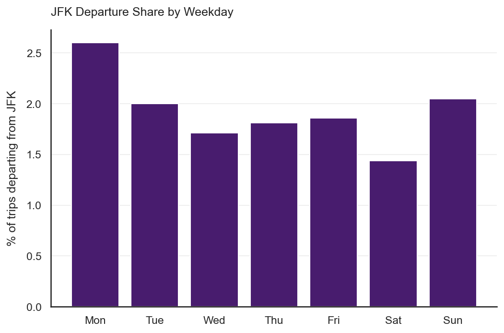
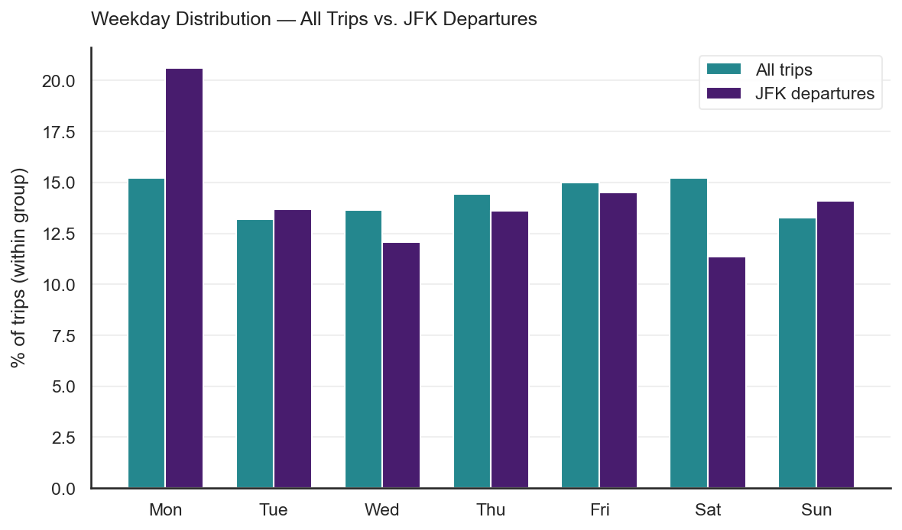
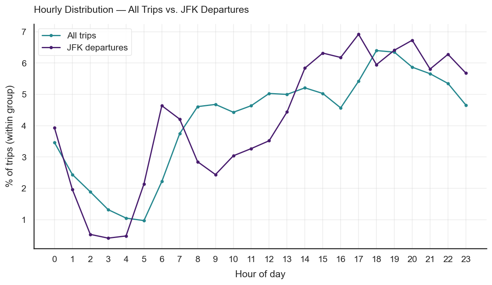

# NYC Taxi Routes

**How many taxis should an NYC operator station at JFK airport? — 300k trips, 2016 Yellow Taxi data.**


---

## TL;DR

**Target:** share of trips departing from JFK airport — out of all recorded taxi trips · **Scope:** NYC, 2016, 300k trips



- Only **1.93%** of all trips depart from JFK (5,649 of 293,369 cleaned trips) — a small slice of total volume.
- Trips touching JFK (either pickup or dropoff) total **2.6%** of all trips (7,613 trips) but roughly **10%** of total fare revenue — a JFK trip earns nearly 4× an average trip.
- JFK demand is **not flat**: **Monday** has the highest JFK share (2.60%), **Saturday** the lowest (1.44%) — a 1.35× vs. 0.75× swing around the weekly average.
- JFK's peak hour (**17:00**) comes an hour before the network-wide peak (**18:00**), and early morning (5–6am) JFK share runs **~2× higher** than general traffic at that hour — likely early flight departures.
- The vast majority of business (97.2% of trips, 83.8% of distance) stays entirely within the NYC metro area — JFK is a small but high-value niche.

---

## Where to start

| You are… | Start here |
| :--- | :--- |
| New to the project | [`00_introduction`](notebooks/00_introduction.ipynb) — scenario, data dictionary, geo bounds |
| Looking for the JFK finding | [`03_analysis`](notebooks/03_analysis.ipynb) — route breakdown, JFK departure share |
| Looking for the pipeline | [`02_preparation`](notebooks/02_preparation.ipynb) — cleaning + feature engineering |

---

## Table of Contents

- [Project Overview](#project-overview)
- [Problem Statement](#problem-statement)
- [Dataset](#dataset)
- [Approach](#approach)
- [Results](#results)
- [Notebooks](#notebooks)
- [Tech Stack](#tech-stack)
- [Reports & Artifacts](#reports--artifacts)
- [Setup](#setup)
- [Author](#author)

---

## Project Overview

Originally a [StackFuel](https://stackfuel.com) practice project (Module 2 / Chapter 7): analyze a real
2016 NYC Yellow Taxi trip dataset to answer a concrete operational question for a taxi fleet operator.
JFK airport sits far from Manhattan's core business district — taxis that drop passengers there take a
long time to become available again for other areas, but airport-bound passengers tend to travel longer,
more lucrative routes. The operator needs to know how many taxis to station at JFK.

| Phase | Scope | Where |
| :--- | :--- | :--- |
| **Data Preparation** | Cleaning (error masks + business-scope masks), feature engineering (geo-routes, economics, time segments) | [`02_preparation`](notebooks/02_preparation.ipynb) |
| **Analysis** | Route classification (JFK/NYC/Other), departure share | [`03_analysis`](notebooks/03_analysis.ipynb) |
| **Insights** | Weekday/hourly breakdown, fleet-sizing recommendation | [`04_insights`](notebooks/04_insights.ipynb) |

---

## Problem Statement

**Core question:** what share of trips depart from JFK — overall, by weekday, and by hour — and what
does that imply for how many taxis should wait at the airport?

| Sub-question | Status |
| :--- | :---: |
| 1. Load, inspect, clean the data | ✅ |
| 2. Filter to relevant scope | ✅ |
| 3. JFK departure share overall | ✅ — 1.93% |
| 4. Visualize pickup locations across NYC | ✅ |
| 5. JFK departure share by weekday | ✅ — Mon 2.60% (highest) / Sat 1.44% (lowest) |
| 6. Weekday distribution — overall vs. JFK | ✅ |
| 7. Hourly distribution — overall vs. JFK | ✅ |
| 8. Custom visualizations | ⬜ — cosmetic, not blocking |
| 9. Final recommendation | ✅ |

→ Full original task description: [docs/infos.md](docs/infos.md)

---

## Dataset

**Source:** `2016_Yellow_Taxi_prepared.csv` — provided by StackFuel for this exercise

| Property | Value |
| :--- | :--- |
| Rows (raw) | 300,000 |
| Rows (after cleaning) | 293,369 |
| Columns (raw) | 12 |
| Period | 2016 |
| City | New York City |

**Columns:** `pickup_weekday` · `pickup_hour` · `pickup_longitude/latitude` · `dropoff_longitude/latitude` ·
`passenger_count` · `trip_distance` · `fare_amount` · `tip_amount` · `tolls_amount` · `payment_type`
→ full data dictionary: [`00_introduction.ipynb`](notebooks/00_introduction.ipynb)

**Geo bounds** (used to classify JFK vs. NYC vs. Other, see `nyc_taxi_routes.utils.JFK`/`.NYC`):

| Area | lat_min | lat_max | lon_min | lon_max |
| :--- | :---: | :---: | :---: | :---: |
| JFK | 40.62666 | 40.66018 | -73.80822 | -73.76599 |
| NYC | 40.5774 | 40.9176 | -74.15 | -73.7004 |

**Cleaning removed 6,631 rows (2.2%):** 24 exact duplicates · fare/tip outside plausible range (Finance) ·
passenger count / trip distance outside plausible range (Physics) · coordinates outside NYC bounds (Geography) ·
long distance at near-zero fare, indicating a sensor defect (Logic).

---

## Approach

### Data Preparation

→ [`02_preparation`](notebooks/02_preparation.ipynb)

- **Cleaning** (`data/cleaning.py`) — masks split into technical measurement errors (impossible values) vs.
  business-scope exclusions (plausible but outside the analysis focus, e.g. fares > $250)
- **Feature engineering** (`features/engineering.py`) — geo-route classification (`departure`/`arrival`/`route`),
  economic metrics (`total_yield`, `price_per_mile`), time segments (`time_slot`, `is_weekend`), log-transforms
  for skewed numeric columns

### Analysis

→ [`03_analysis`](notebooks/03_analysis.ipynb)

Route-level aggregation (trip count, distance, fare — each as % of total) classifies every trip into one of
9 route types (JFK-JFK, JFK-NYC, JFK-OTHER, NYC-JFK, NYC-NYC, NYC-OTHER, OTHER-NYC, OTHER-OTHER). This
directly answers the departure-share question and exposes how disproportionately valuable JFK routes are
per trip. Follow-up breakdowns cover pickup-location geography, JFK share by weekday, and weekday/hourly
distribution of JFK vs. overall demand.

### Insights

→ [`04_insights`](notebooks/04_insights.ipynb)

Executive summary translating the analysis into concrete, evidence-backed fleet-allocation recommendations
(see [Results](#results) below).

---

## Results

### Route breakdown (293,369 cleaned trips)

| Route | Trips | % of trips | % of fare revenue |
| :--- | ---: | ---: | ---: |
| NYC → NYC | 285,174 | 97.21% | 88.90% |
| JFK → NYC | 5,445 | 1.86% | 7.01% |
| NYC → JFK | 1,964 | 0.67% | 2.79% |
| NYC → Other | 551 | 0.19% | 1.06% |
| JFK → Other | 61 | 0.02% | 0.11% |
| JFK → JFK | 143 | 0.05% | 0.08% |
| Other → Other | 30 | 0.01% | 0.03% |
| Other → NYC | 1 | 0.00% | 0.00% |

**JFK departure share: 1.93%** (5,649 of 293,369 trips). All trips touching JFK — pickup or dropoff,
i.e. JFK-JFK + JFK-NYC + JFK-Other + NYC-JFK — total **7,613 trips (2.6%)** but **9.99% of fare
revenue**: a JFK trip earns roughly 4× the revenue of an average trip.

### Weekday & hourly patterns




Monday is both the highest-share JFK weekday (2.60%) and overrepresented among JFK trips (20.61% of all
JFK trips vs. 15.24% of all trips — a 1.35× skew). Saturday is the opposite: 11.38% of JFK trips vs. 15.23%
of all trips (0.75×). Hourly, the network-wide peak is 18:00 but JFK's own peak is 17:00, and early morning
(5–6am) JFK share runs roughly 2× the general traffic share at that hour — consistent with early flight
departures.

### Recommendations

| Recommendation | Evidence | Priority |
| :--- | :--- | :---: |
| Station ~35% more JFK taxis on Mondays than the weekly average | Monday: 20.61% of JFK trips vs. 15.24% of all trips (1.35×) | High |
| Reduce JFK presence ~25% on Saturdays vs. weekly average | Saturday: 11.38% of JFK trips vs. 15.23% of all trips (0.75×) | High |
| Double early-shift (5–7am) JFK coverage relative to general demand at that hour | 5am: 2.14% JFK share vs. 0.97% overall (2.2×); 6am: 4.64% vs. 2.22% (2.1×) | Medium |
| Shift the JFK evening peak shift to 17:00, not 18:00 like the general network | JFK peak hour 17:00 vs. network-wide peak 18:00 | Medium |
| Prioritize JFK taxis for NYC→JFK return fares over idle repositioning | JFK trips earn ~4× an average trip (9.99% of fare revenue from 2.6% of trips) | Medium |

→ Full write-up: [`04_insights.ipynb`](notebooks/04_insights.ipynb). Note: the dataset has no absolute
fleet-size figure — the factors above are relative weightings, not taxi counts.

---

## Notebooks

| Notebook | What you'll find |
| :--- | :--- |
| [00_introduction](notebooks/00_introduction.ipynb) | Scenario, project facts, data dictionary, geo bounds |
| [01_exploration](notebooks/01_exploration.ipynb) | EDA: distributions, data quality, correlations, outliers |
| [02_preparation](notebooks/02_preparation.ipynb) | Cleaning strategy, feature engineering, export |
| [03_analysis](notebooks/03_analysis.ipynb) | Route classification, JFK departure share, pickup-location map, weekday/hourly breakdown |
| [04_insights](notebooks/04_insights.ipynb) | Executive summary + fleet-allocation recommendations |

---

## Tech Stack

| Category | Tools |
| :--- | :--- |
| Language | Python 3.10 |
| Data | Pandas, NumPy, PyArrow |
| Visualisation | Matplotlib · Seaborn · Plotly · Folium |
| ML utilities | Scikit-learn (available, not yet used — no modeling in scope) |
| Packaging | uv · pyproject.toml |
| Toolkit | [wgnd-toolkit](https://github.com/kaywiegand/wgnd-toolkit) — shared analytics helpers |
| Notebooks | JupyterLab |

---

## Reports & Artifacts

| Artifact | Link |
| :--- | :--- |
| Hub (landing page) | [`public/index.html`](public/index.html) — placeholder, filled once `/project-case` runs |

---

## Setup

```bash
git clone <repo-url>
cd nyc-taxi-routes
uv venv && source .venv/bin/activate
uv pip install -e ".[da]"
jupyter lab
```

> Raw data (`2016_Yellow_Taxi_prepared.csv`) is not included — place it under `data/raw/` before running
> `02_preparation.ipynb`.

---

## Author

**Kay Alexander Wiegand**
Senior Consultant · Data Scientist · Berlin
[LinkedIn](https://de.linkedin.com/in/kaywiegand) · [GitHub](https://github.com/kaywiegand)

*Originally a [StackFuel](https://stackfuel.com) exercise · built with
[`wgnd-toolkit`](https://github.com/kaywiegand/wgnd-toolkit) and
[`wgnd-scaffolding`](https://github.com/kaywiegand/wgnd-scaffolding).*
